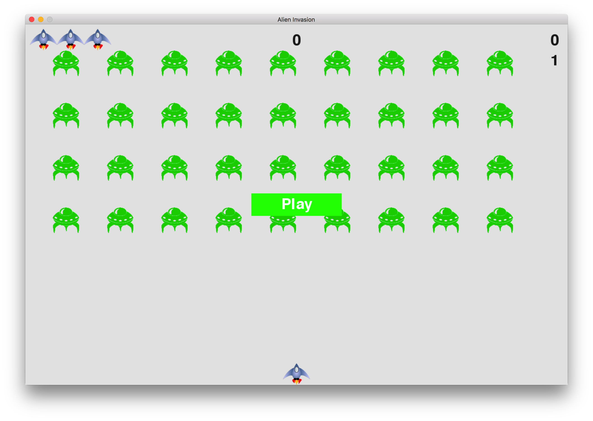

# 这是一个使用Python编写的街机小游戏-《外星人入侵》

整个游戏尽量做到了*短小精悍*且使用的是完全**面向对象**的方式实现的。  

游戏各个类文件简介:  
 | 类名                  |  功能描述                                                                              |  
 | -------------------- |:--------------------------------------------------------------------------------------:| 
 | alien.py             |  外星人类                                                                               |  
 | alien_invasion.py    |  游戏的主函数                                                                            |  
 | bullet.py            |  子弹类                                                                                 |  
 | button.py            |  按钮类                                                                                 |  
 | game_function.py     |  游戏逻辑类,封装了各种游戏逻辑                                                             |  
 | game_stats.py        |  游戏状态类,存储了游戏状态信息                                                             |  
 | scoreboard.py        |  榜单类,显示游戏顶部的各种分数信息                                                          |  
 | settings.py          |  设置类,存储了游戏的全局信息。比如,游戏的背景色、外星人移动的速度、子弹的大小、游戏递增的难度系数等  |  
 | ship.py              |  飞船类                                                                                 |  
 
 
 (本游戏来自《Python 编程从入门到精通》)
